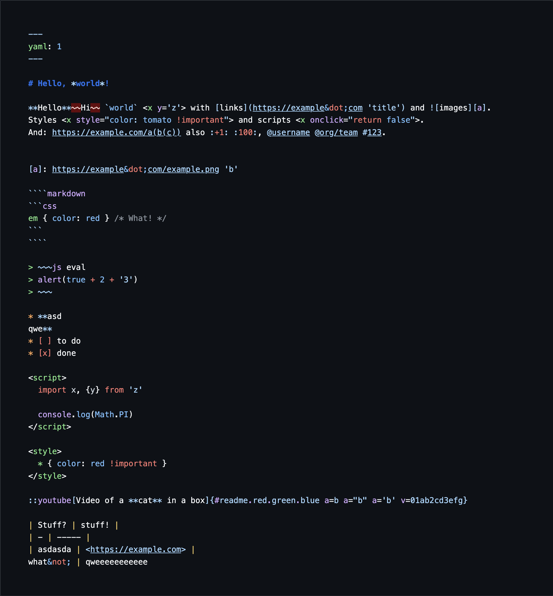
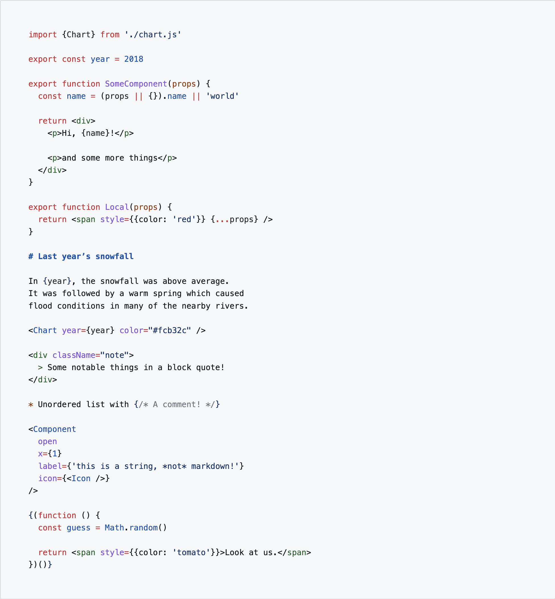

# markdown-tm-language

[![Build][build-badge]][build]

Really good syntax highlighting for [markdown][] and [MDX][].

<table>
<tr valign="middle">
<td align="center">
  <a href="https://wooorm.com/markdown-tm-language/"></a>
</td>
</tr>
<tr>
<td align="center">
  Example of markdown highlighting (using GitHub dark mode theme)
</td>
</tr>
</table>

<table>
<tr valign="middle">
<td align="center">
  <a href="https://wooorm.com/markdown-tm-language/"></a>
</td>
</tr>
<tr>
<td align="center">
  Example of MDX highlighting (using GitHub light mode theme)
</td>
</tr>
</table>

## Contents

*   [What is this?](#what-is-this)
*   [When should I use this?](#when-should-i-use-this)
*   [Install](#install)
    *   [`starry-night`](#starry-night)
    *   [`shiki`](#shiki)
    *   [VS Code](#vs-code)
    *   [Sublime and TextMate](#sublime-and-textmate)
*   [Use](#use)
*   [API](#api)
*   [Syntax](#syntax)
*   [Compatibility](#compatibility)
*   [Security](#security)
*   [Related](#related)
*   [Contribute](#contribute)
*   [License](#license)

## What is this?

This project includes high quality TextMate grammars for [markdown][] and
[MDX][].

[Try it out in the playground »][demo]

## When should I use this?

You can use these grammars in your code editor or with
[`starry-night`][starry-night] and [`shiki`][shiki].

## Install

### `starry-night`

You can currently use the `text.md.js` and `source.mdx.js` files in this repo
with [`starry-night`][starry-night].
The plan is to get these grammars into GitHub, at which point they’ll be in
`starry-night` proper.

### `shiki`

The plan is to get these grammars into Shiki, at which point you can use them
from there.

### VS Code

To do.

### Sublime and TextMate

I’m not a Sublime or TextMate user and I am not very interested in maintaining
a packages for them currently.
You should be able to clone this repo somewhere
(`~/.config/sublime-text-2/Packages`?),
then you should reportedly be able to use these grammars.

PR welcome to improve this section or do the work to make it happen :)

## Use

After installing, type some things!

Or [use the playground][demo].

## API

There is no API.

You can generate your own grammars, by modifying `languages` in `build.js`.
To illustrate, you can add a new `language` there, or turn on or off several
extensions (such as `gfm`) in the existing ones.

## Syntax

Markdown is handled according to CommonMark and common extensions:

*   directives
*   frontmatter (YAML, TOML)
*   GFM (autolink literals, footnotes, strikethrough, tables, tasklists)
*   GitHub (gemoji, mentions, references)
*   math<sup>(†)</sup>
*   MDX (ESM, expressions, JSX)

<sup>(†)</sup> — with two or more dollars.

## Compatibility

The markdown grammar supports CommonMark and common extensions: directives,
frontmatter, GFM, GitHub, and math.
The MDX grammar is similar, but of course uses the MDX syntax extensions, and
does not include directives.

## Security

Should be good!

## Related

*   [`micromark`](https://github.com/micromark/micromark)
    — markdown parser in JavaScript
*   [`markdown-rs`](https://github.com/wooorm/markdown-rs)
    — markdown parser in Rust

## Contribute

Yes please!
See [How to Contribute to Open Source][contribute].

In particular, see `grammar.yml`, that’s likely where your changes will go,
and it includes a ton of information on how it all works.

You might also want to check if the grammars here work with linguist.
Perform these steps:

```sh
git clone gh:github/linguist
cd linguist
./script/bootstrap
# copy/paste this repo in `linguist`
script/grammar-compiler add markdown-tm-language
```

## License

[MIT][license] © [Titus Wormer][author]

<!-- Definitions -->

[build-badge]: https://github.com/wooorm/markdown-tm-language/workflows/main/badge.svg

[build]: https://github.com/wooorm/markdown-tm-language/actions

[license]: license

[author]: https://wooorm.com

[contribute]: https://opensource.guide/how-to-contribute/

[markdown]: https://commonmark.org

[mdx]: https://mdxjs.com

[demo]: https://wooorm.com/markdown-tm-language/

[starry-night]: https://github.com/wooorm/starry-night

[shiki]: https://github.com/shikijs/shiki
